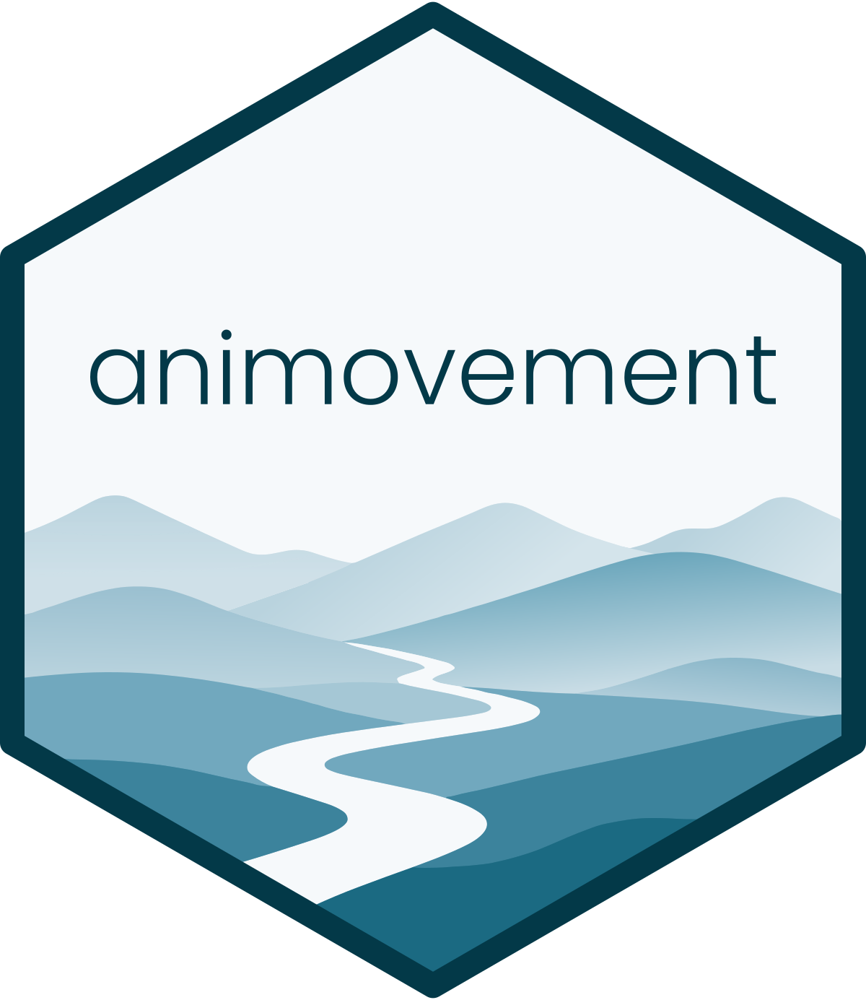
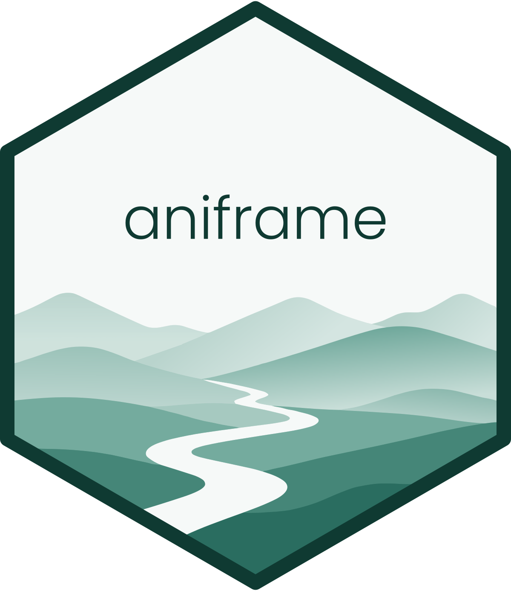
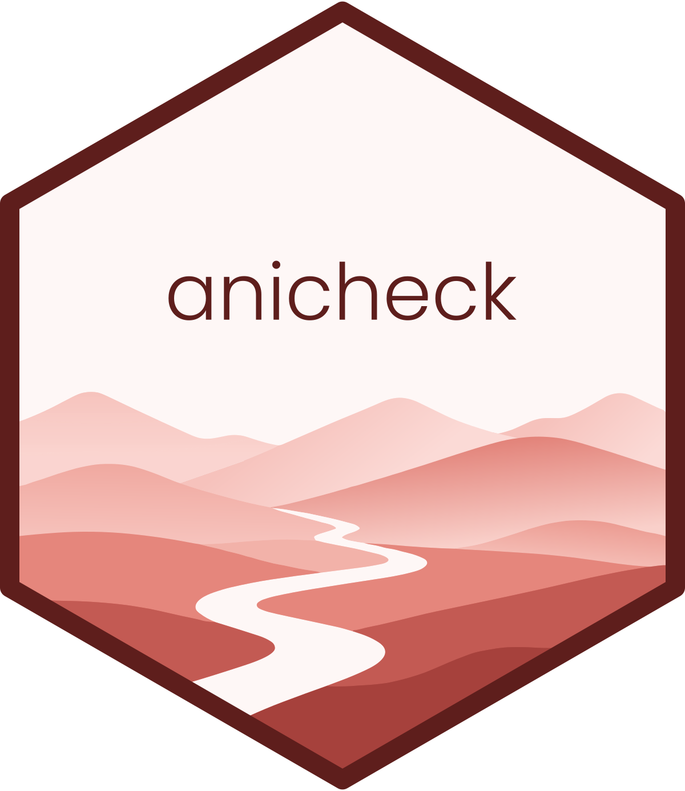
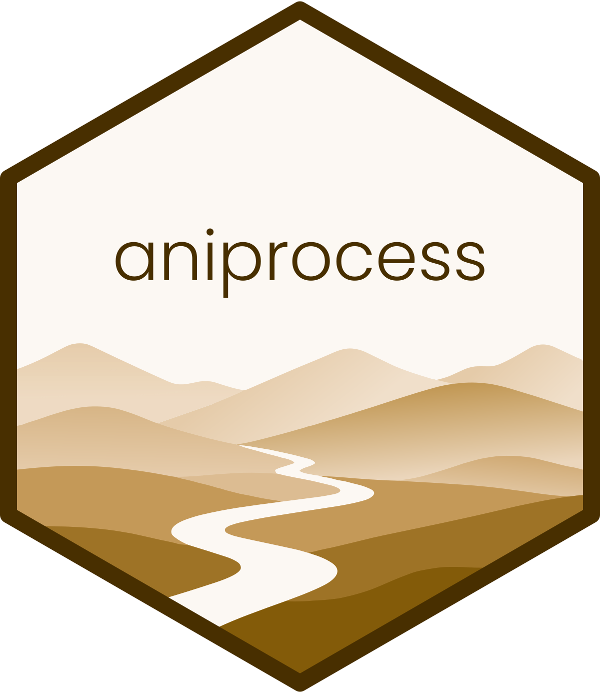
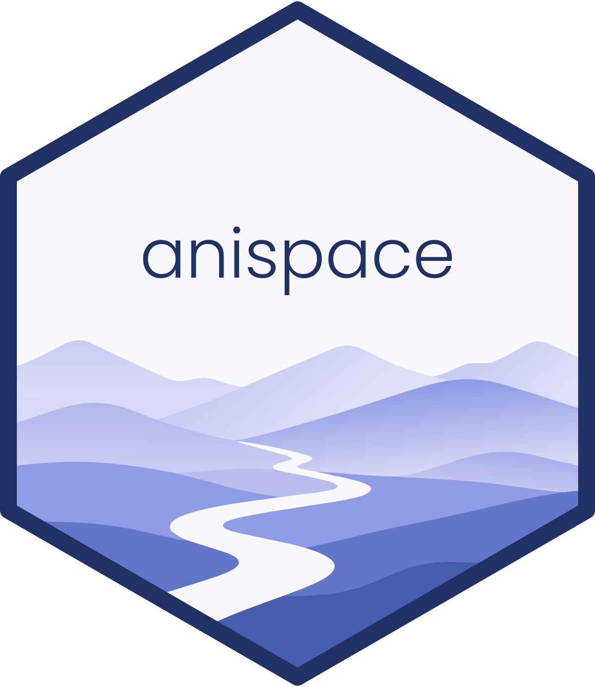
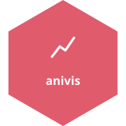

## Installation and use

Install many of the packages in the *animovement* ecosystem by running:

```r
install.packages(
  "animovement",
  repos = c("https://animovement.r-universe.dev", "https://cloud.r-project.org")
)
```

Run `library(animovement)` to load the core packages and make them available in
your current R session.

## Core packages

The *animovement* packages work together across every stage of the
movement-analysis workflow:

::: {.pkg-list}
```{=html}
<svg class="pkg-rail" viewBox="0 0 180 1560" width="180" role="img" aria-label="animovement packages"><polygon class="empty" points="61.7,133.0 115.4,164.0 115.4,226.0 61.7,257.0 8.0,226.0 8.0,164.0"/><polygon class="empty" points="61.7,328.0 115.4,359.0 115.4,421.0 61.7,452.0 8.0,421.0 8.0,359.0"/><polygon class="empty" points="61.7,523.0 115.4,554.0 115.4,616.0 61.7,647.0 8.0,616.0 8.0,554.0"/><polygon class="empty" points="61.7,718.0 115.4,749.0 115.4,811.0 61.7,842.0 8.0,811.0 8.0,749.0"/><polygon class="empty" points="61.7,913.0 115.4,944.0 115.4,1006.0 61.7,1037.0 8.0,1006.0 8.0,944.0"/><polygon class="empty" points="61.7,1108.0 115.4,1139.0 115.4,1201.0 61.7,1232.0 8.0,1201.0 8.0,1139.0"/><polygon class="empty" points="61.7,1303.0 115.4,1334.0 115.4,1396.0 61.7,1427.0 8.0,1396.0 8.0,1334.0"/><a href="https://animovement.dev/animovement" aria-label="animovement"><image href="../assets/logos/animovement.svg" x="56.0" y="35.5" width="124.0" height="124.0"/></a><a href="https://animovement.dev/aniframe" aria-label="aniframe"><image href="../assets/logos/aniframe.svg" x="56.0" y="230.5" width="124.0" height="124.0"/></a><a href="https://animovement.dev/aniread" aria-label="aniread"><image href="../assets/logos/aniread.svg" x="56.0" y="425.5" width="124.0" height="124.0"/></a><a href="https://animovement.dev/anicheck" aria-label="anicheck"><image href="../assets/logos/anicheck.svg" x="56.0" y="620.5" width="124.0" height="124.0"/></a><a href="https://animovement.dev/aniprocess" aria-label="aniprocess"><image href="../assets/logos/aniprocess.svg" x="56.0" y="815.5" width="124.0" height="124.0"/></a><a href="https://animovement.dev/anispace" aria-label="anispace"><image href="../assets/logos/anispace.svg" x="56.0" y="1010.5" width="124.0" height="124.0"/></a><a href="https://animovement.dev/animetric" aria-label="animetric"><image href="../assets/logos/animetric.svg" x="56.0" y="1205.5" width="124.0" height="124.0"/></a><a href="https://animovement.dev/anivis" aria-label="anivis"><image href="../assets/logos/anivis.svg" x="56.0" y="1400.5" width="124.0" height="124.0"/></a></svg>
```

::: {.pkg-texts}
::: {.pkg-item}
[{.pkg-logo-inline}](https://animovement.dev/animovement)

[animovement](https://animovement.dev/animovement){.pkg-name}

The metapackage that installs and loads the core packages you need for movement analysis. [Go to package …](https://animovement.dev/animovement){.pkg-go}
:::

::: {.pkg-item}
[{.pkg-logo-inline}](https://animovement.dev/aniframe)

[aniframe](https://animovement.dev/aniframe){.pkg-name}

The core data structures — S3 classes for representing and manipulating movement data. [Go to package …](https://animovement.dev/aniframe){.pkg-go}
:::

::: {.pkg-item}
[{.pkg-logo-inline}](https://animovement.dev/aniread)

[aniread](https://animovement.dev/aniread){.pkg-name}

Reads and writes movement data from diverse sources, from video tracking tools to trackballs. [Go to package …](https://animovement.dev/aniread){.pkg-go}
:::

::: {.pkg-item}
[{.pkg-logo-inline}](https://animovement.dev/anicheck)

[anicheck](https://animovement.dev/anicheck){.pkg-name}

Diagnoses data quality — missing values, temporal gaps and spatial outliers. [Go to package …](https://animovement.dev/anicheck){.pkg-go}
:::

::: {.pkg-item}
[{.pkg-logo-inline}](https://animovement.dev/aniprocess)

[aniprocess](https://animovement.dev/aniprocess){.pkg-name}

Filters, smooths and processes movement trajectories. [Go to package …](https://animovement.dev/aniprocess){.pkg-go}
:::

::: {.pkg-item}
[{.pkg-logo-inline}](https://animovement.dev/anispace)

[anispace](https://animovement.dev/anispace){.pkg-name}

Spatial transformation methods for movement data — reproject, rescale and reframe trajectories. [Go to package …](https://animovement.dev/anispace){.pkg-go}
:::

::: {.pkg-item}
[{.pkg-logo-inline}](https://animovement.dev/animetric)

[animetric](https://animovement.dev/animetric){.pkg-name}

Calculates movement metrics — kinematics, navigational statistics and social interaction measures. [Go to package …](https://animovement.dev/animetric){.pkg-go}
:::

::: {.pkg-item}
[{.pkg-logo-inline}](https://animovement.dev/anivis)

[anivis](https://animovement.dev/anivis){.pkg-name}

Publication-ready plots of trajectories, diagnostic summaries and calculated metrics. [Go to package …](https://animovement.dev/anivis){.pkg-go}
:::
:::
:::
